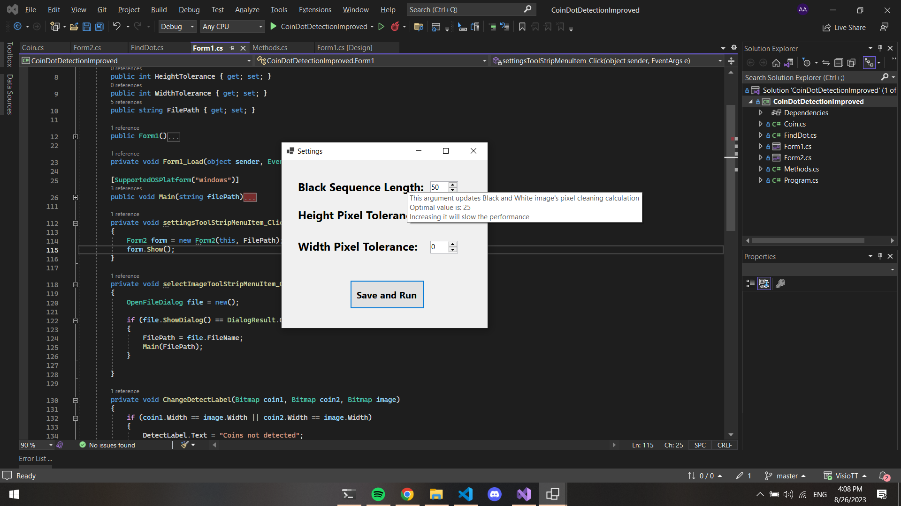

# VisioTT

I've worked on 3 projects in ascending order of difficulty during my internship. These projects were about Image-Processing in C#. Feel free to check out them below

## Projects

<h2> Face Similarity (With Emgu Library)</h2>

Face Similarity program using EmguCV. EmguCV is a library that allows us to use OpenCV in C#. So I used OpenCV's face detection functions to implement simple similarity algorithm that I wrote. The algorithm extracts both faces and compares each image pixel's color similarity and calculates a similarity score. In addition program works in real-time and uses video capture device as input device.

<h3 align=center>

Face Detection Similarity Check

</h3>
 

<h2> Coin Dot Detection Project (Using GetPixel) (Without Library)</h2>

This is the first long-term project that is assigned to me. In this project **I was challenged to not use any library or module** for any process. Just by using C# System functions, I needed to detect both coins and determine which one has black dot on it.

So I've focused on developing two algorithms, one for *detecting coins* and the other for *determining which coin has dot on it*.

Firstly, I needed to detect coins. I did this using pixel similarity formula from the face similarity program. If pixel is similar with gray, pass that pixel, else set pixel as red (Image 1). [Note: In the next sections I implemented a method that scans image's specific percentage and determines background color to not use a single static color gray.]

And that means I can tell the difference between coin and background. So I worked on algorithm that based on this.

First, I scanned image pixels vertically to find coin's width, then I scanned horizontally to detect height (Image 2-3-4-5-6).

Then I draw rectangles around coins using that coordinates (Image 7-8). That means I detected the coins and now I can extract them as two images and run a dot detection algorithm (Image 9).

So I implemented a simple dot detection algorithm that counts black pixels in image since I can use coins as 2 different images (Image 10).

Afterwards I draw ellipse on coin with dot (Image 11) and I added a settings section to not use any static variables in the program (Image 12-13). 

<h3 align=center>

1) Detecting Coins

</h3>
 

<h3 align=center>

2) Finding First Coin X Start

</h3>
 

<h3 align=center>

3) Finding First Coin X End

</h3>
 

<h3 align=center>

4) Finding Both Coins X Axis

</h3>
 

<h3 align=center>

5) Drawing Red Lines for Width

</h3>
 

<h3 align=center>

6) Drawing Red Lines For Height

</h3>
 

<h3 align=center>

7) Drawing Rectangle For Both Coins - 1

</h3>
 

<h3 align=center>

8) Drawing Rectangle For Both Coins - 2

</h3>
 

<h3 align=center>

9) Cropping Both Coins

</h3>
 

<h3 align=center>

10) Detecting Coin With Dot

</h3>
 

<h3 align=center>

11) Drawing Ellipse to Coin With Dot

</h3>
 

<h3 align=center>

12) Adding Settings Section

</h3>
 

<h3 align=center>

13) Improving Settings section and UI

</h3>
 

<h2> Coin Detection Project Improved (Using byte arrays) (Without Library)</h2>

My first project's method was easy to implement because I was using GetPixel() function. But in that method only way to traverse image pixels was using nested for loops because pixels was stored in 2D matrix. That limitation significantly slows the performance of the program.

So I developed a new algorithm that is based on byte arrays. In byte array, entire image is one dimensional array and that array contains image bytes. Each 3 sequence of bytes represents 1 pixel's RGB. [It has more details like [image stride](https://learn.microsoft.com/en-us/windows/win32/medfound/image-stride) and etc.]

I developed an algorithm that slightly different from the first one because in byte array, I have one dimensional array. In the beginning I converted image to Black and White to seperate background and coins (Image 1). Then I cleared up the black pixels in coin (Image 2). I did that using simple logic that searchs for black sequence of pixels horizontally if there is no sequence, it converts that black pixel to white. 

That was the most time consuming part for the program but it was necessary for finding width and height in next iterations because if we don't clean the black pixels in coin, we need to search for black sequence to determine if the coin ended or not for each byte. But if we clean the pixels then whenever we encounter black pixel, we can say that its the end of the coin (Image 3).

Then I started to develop an algorithm to find width and height (Image 4). It was not working well in the beginning because it has some bugs and logical mistakes (Image 5). But I kept improving the algorithm and finally implemented a solid algorithm that can detect coins and finds width, height and (x,y) coordinates for each coin (Image 6).

After detecting the coins its easy to determine which one has dot in it. I've cropped the coins from image using width and height coordinates. Then I scanned both image by traversing byte arrays. After counting the black pixels I was capable to determine the which coin has dot on it (Image 7).

Finally I've added a settings section (Image 8) to the program to not use static variables in project. Then I've added mouse-hover descriptions (Image 9) for each parameter to explain what are they used for. So any non-fimilar user can use this program which makes this program more user friendly.

<h3 align=center>

1) Converting Image bytes to black and white

</h3>
 

<h3 align=center>

2) Cleaning up black pixels in coin

</h3>
 

<h3 align=center>

3) Improving clearing 

</h3>
 

<h3 align=center>

4) First detection try using byte arrays

</h3>
 

<h3 align=center>

5) Drawing rectangles

</h3>
 

<h3 align=center>

6) Improving detection algorithm

</h3>
 

<h3 align=center>

7) Finishing detection and coin with dot algorithm

</h3>
 

<h3 align=center>

8) Adding settings section to make project dynamic

</h3>
 

<h3 align=center>

9) Adding descriptions for each parameter for information

</h3>

 

<h2> Related </h2>

- [OpenCV](https://github.com/Alperencode/OpenCV): My OpenCV repository that has Face-Detection programs

- [Midi-Project](https://github.com/Alperencode/Midi-Project): My previous summer intern project, which is about real-time editing of midi signals

 