# VisioTT

***Will be updated***

## Images

<h3 align=center>

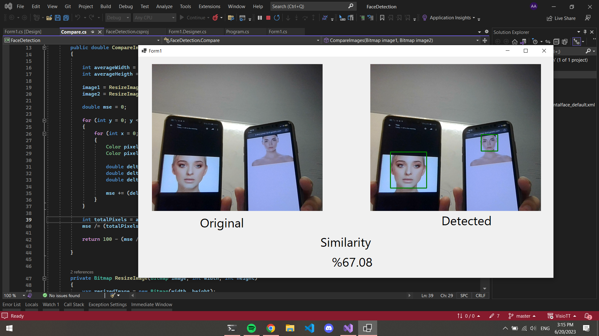

Face Detection Similarity Check

 

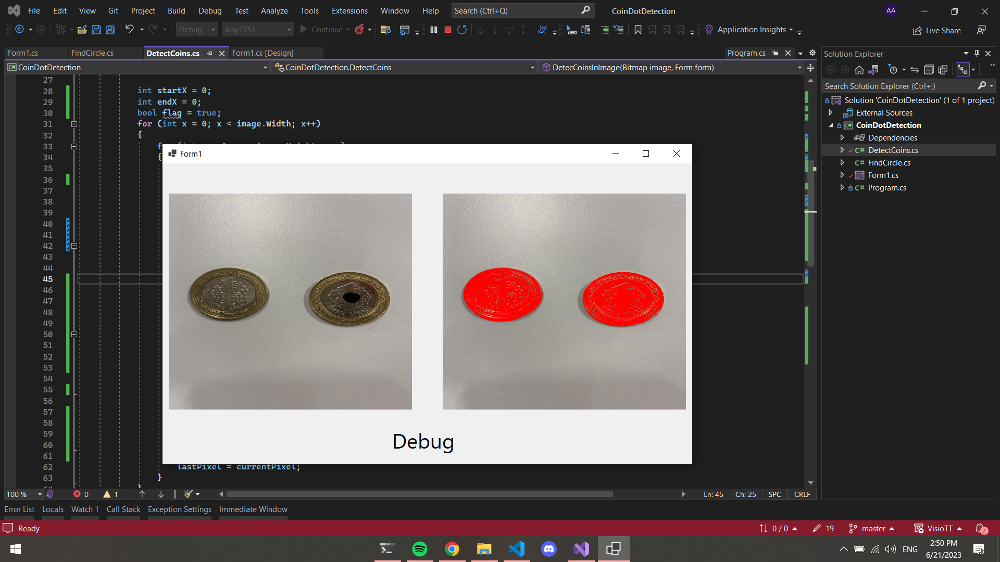

Detecting Coins

 

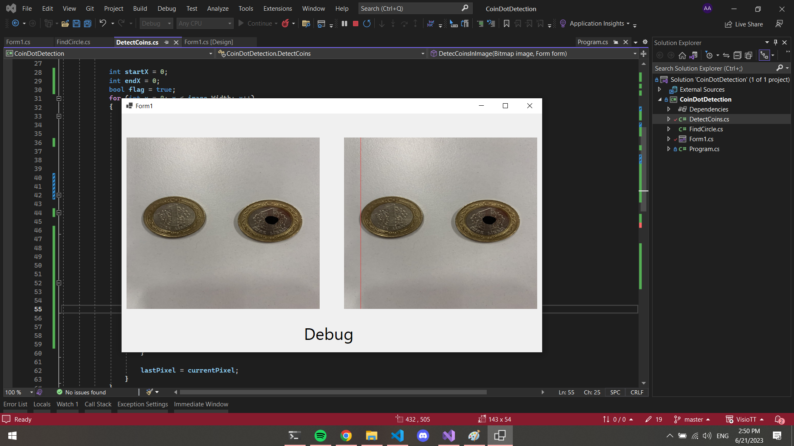

Finding First Coin X Start

 

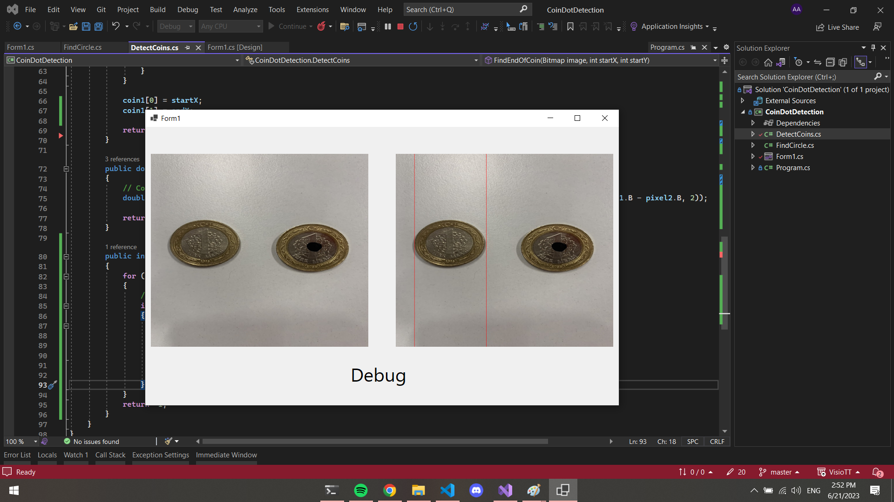

Finding First Coin X End

 

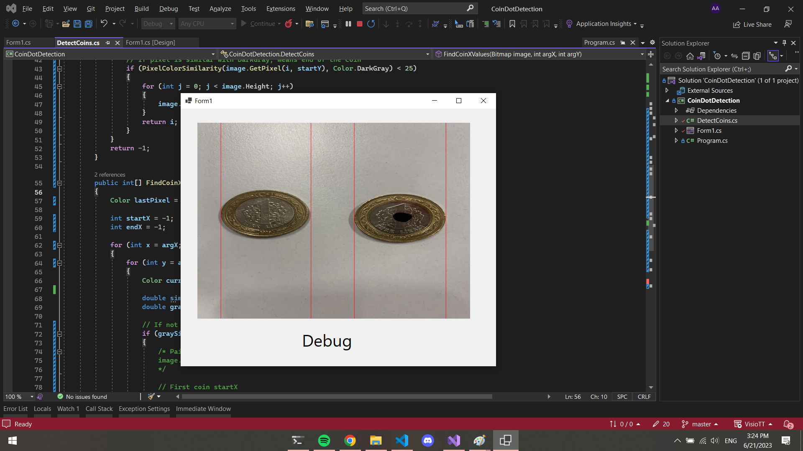

Finding Both Coins X Axis

 

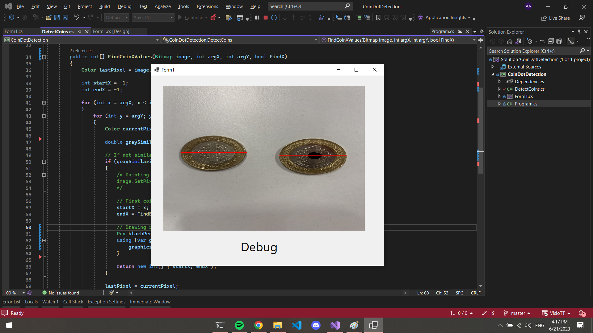

Drawing Red Lines for Coins Width

 

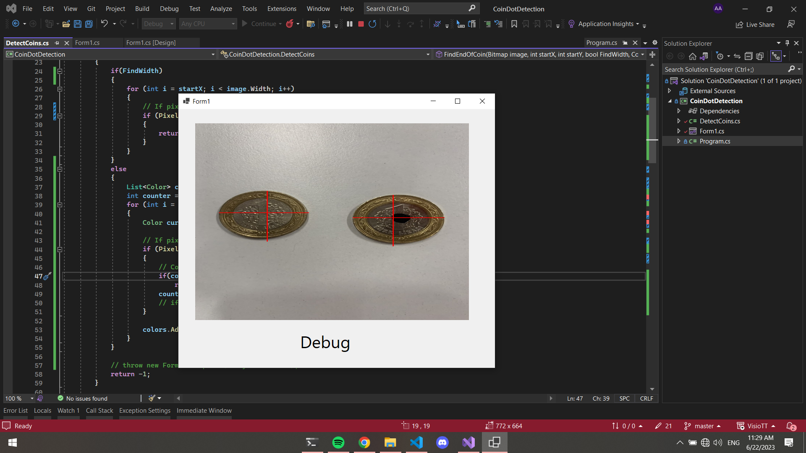

Drawing Red Lines For Both Coins

 

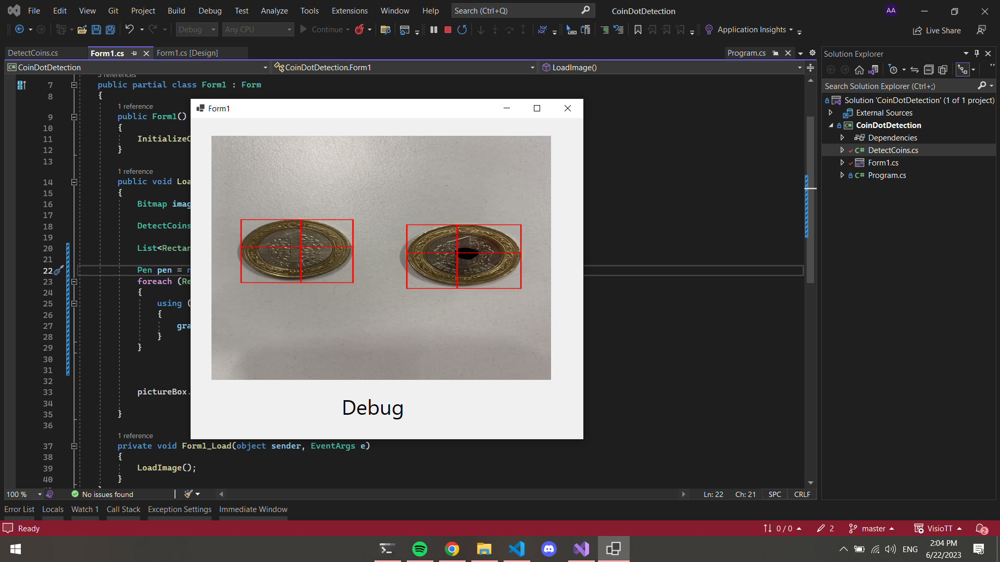

Drawing Rectangle For Both Coins 1

 

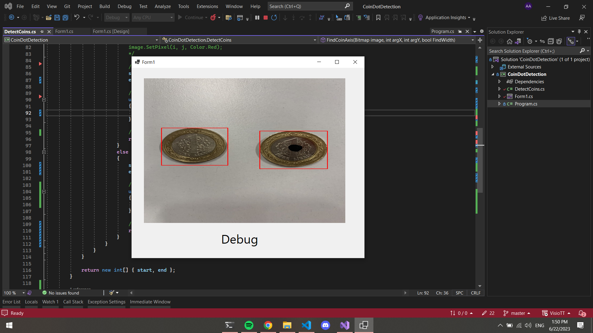

Drawing Rectangle For Both Coins 2

 

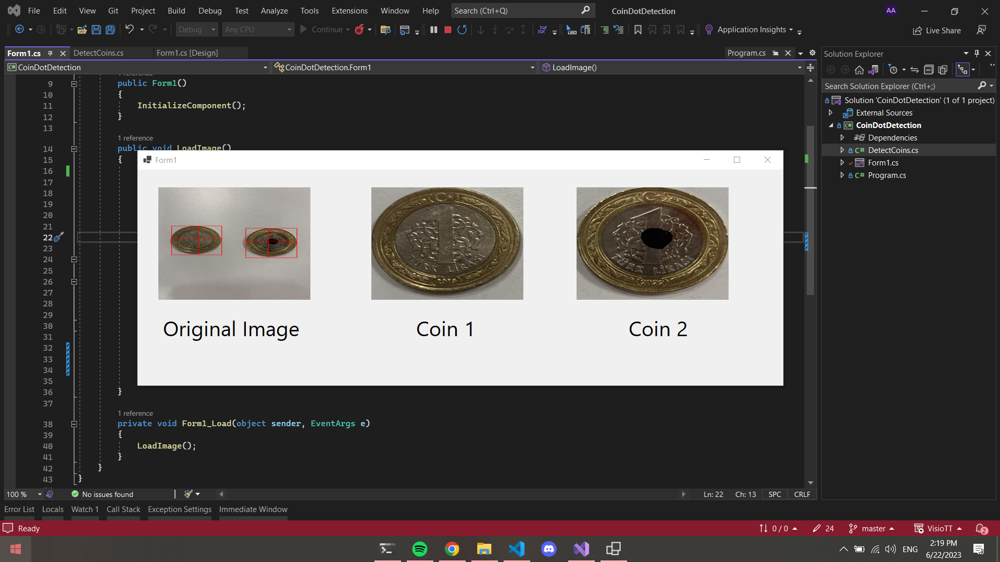

Cropping Both Coins

 

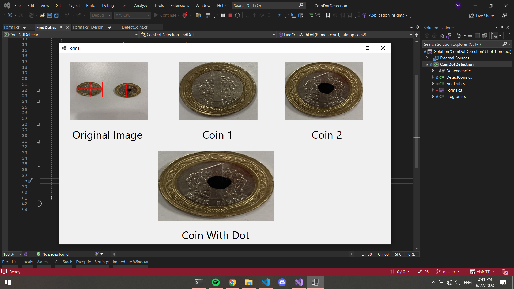

Detecting Coin With Dot

 

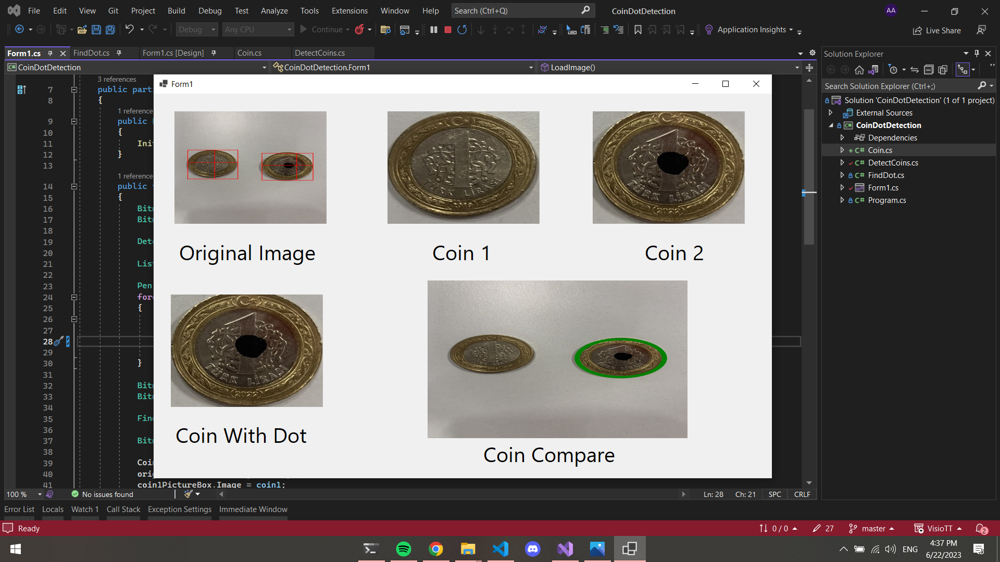

Drawing Ellipse to Coin With Dot

 

</h3>